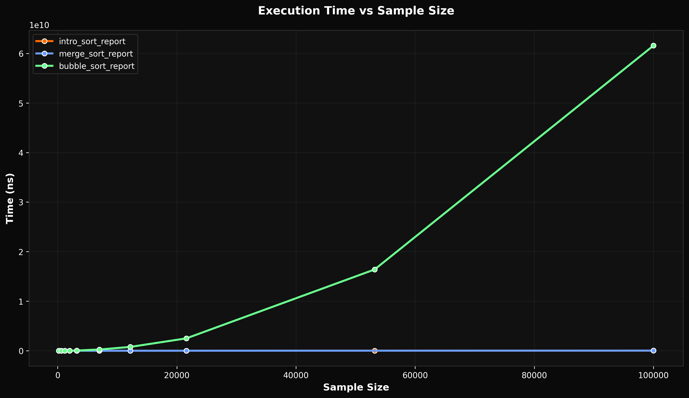

# Simple Runtime Analyzer

<!--[](https://github.com/ShineKnightDev/simple-runtime-analyzer/releases/latest)-->


[](https://github.com/ShineKnightDev/simple-runtime-analyzer)

A C++ Header-Only Runtime Performance Analysis Library

<div class="title_screenshot">



</div>

[TOC]

# Overview

**Simple Runtime Analyzer** is a header-only C++ library for precise runtime performance profiling and benchmarking. It provides a modern, type-safe API to measure and analyze the execution time of functions and algorithms across varying input sizes.  

Engineered with C++23 features, Simple Runtime Analyzer offers a streamlined workflow: from generating customizable sample data and collecting high-resolution timing metrics, to exporting detailed reports in multiple formats (TXT, CSV, JSON). Its modular design decouples measurement from reporting, making it an ideal tool for embedding performance analysis directly into unit tests, CI pipelines, or research projects.

-----

## Motivation

The Simple Runtime Analyzer was born from a desire to create a reproducible and modular tool for measuring execution time using std::chrono. Beyond its benchmarking capabilities, the library is designed as an educational tool to demonstrate algorithmic complexity and real-world runtime behavior across varying input sizes.

-----

## Features

This library provides a set of powerful utilities to streamline your performance analysis.

- ⏱️ **Chrono-Based High-Precision Measurement:** Template-driven timing infrastructure supporting all std::chrono duration units (nanoseconds to hours) for type-safe, flexible benchmarking.
- 📊 **Statistical Runtime Profiling:** Automatically profile functions over a range of input sizes with configurable distribution (logarithmic or linear) for comprehensive performance analysis.
- 🔢 **Smart Sample Generation:** Generate optimized sample datasets with size biasing and rounding controls to stress-test algorithms under realistic conditions.
- 💾 **Multi-Format Extensible Reporting:** Export detailed results in human-readable (TXT), structured (CSV), or machine-readable (JSON) formats for seamless integration with external tools.
- 📈 **Built-In Python Visualization Tool:** Includes a dedicated script for generating plots and charts from exported data using matplotlib for immediate insight.
- 🏗️ **Header-Only Modular Design:** Zero-compilation overhead with a decoupled architecture that separates measurement, sampling, and reporting for easy integration and customization.
- 🎯 **Modern C++23 Compliance:** Leverages concepts, ranges, and type traits for a safe, expressive, and compile-time validated API.

-----

## Library Modules

- [Runtime Analyzer:](docs/runtime_analyzer.md) Core timing and profiling functionality
- [Runtime Reporter:](docs/runtime_reporter.md) Multi-format report generation
- [Sample Utilities:](docs/sample_utilities.md) Sample generation and serialization
- [Plot Tool:](docs/plot_generation.md) Data visualization and graphing

-----

## Output Formats

- [.txt](\ref txt_format) Text Format
- [.csv](\ref csv_format) CSV Format
- [.json](\ref json_format) JSON Format
- [.png](\ref png_format) Plot Tool Output

-----

## Examples

The `example.cpp` file provides a complete, working example of how to use the Simple Runtime Analyzer library. This file demonstrates a full performance analysis workflow, from generating test data and profiling an algorithm to reporting the results and generating a visual plot. You can find this example at the following path:

`example/src/example.cpp`

-----

## Getting Started

### Requirements

- C++23 compatible compiler
- Python 3.6+ with the `matplotlib` library (for visualization)

### Installation

Since the Simple Runtime Analyzer is a header-only library, it's very easy to use and requires no pre-compilation or installation. You can get the latest version of the headers here: [releases](https://github.com/ShineKnightDev/simple-runtime-analyzer/releases).

#### C++ Library Usage

To use the library's components in your code, simply include the necessary header files. All functions and structures are located within the `sra` namespace.

```cpp
#include "shineknightdev/runtime_analyzer.hpp"
#include "shineknightdev/runtime_reporter.hpp"
#include "shineknightdev/sample_utilities.hpp"
```

#### Plotting Script Usage

Once you've generated reports using the C++ library, you can visualize them with the `plot.py` script from the command line. Simply pass the report files as arguments.

```bash
python plot.py output_file_1.json output_file_2.csv
```

-----

## Project Tree

```txt
simple-runtime-analyzer
├─ .clang-format
├─ .clang-tidy
├─ CMakeLists.txt
├─ CODE_OF_CONDUCT.md
├─ docs/
├─ Doxyfile
├─ LICENSE.md
├─ README.md
├─ example
│  └─ src
│     └─ example.cpp
├─ include
│  └─ shineknightdev
│     ├─ runtime_analyzer.hpp
│     ├─ runtime_reporter.hpp
│     └─ sample_utilities.hpp
└─ scripts
   └─ plot.py
```

-----

## Building the Project

```bash
# Configure with documentation enabled
cmake -B build -S . -DBUILD_DOCUMENTATION=ON

# Build everything
cmake --build build

# Generate documentation
cmake --build build --target docs

# Run example
cmake --build build --target example_run
```

-----

## Documentation

For a comprehensive overview of the library, including a detailed API reference for each module, please visit the official documentation website.

<https://shineknightdev.github.io/simple-runtime-analyzer>

-----

## Community & Contributing

If you like the project and it seems useful, consider give a star ⭐️ to the repository to show your support and [**Follow me on Github**](https://github.com/ShineKnightDev) To be aware of my new projects.
I appreciate all kinds of contributions. Whether you are reporting an error, suggesting a new feature or sending a change of code, your help is valuable.

⚖️ [**Code of Conduct**](https://github.com/ShineKnightDev/simple-runtime-analyzer/blob/master/CODE_OF_CONDUCT.md) A set of rules to ensure the community remains a welcoming and inclusive place.

👷🏻‍♂️ [**Contributing Guide**](https://github.com/ShineKnightDev/simple-runtime-analyzer/blob/master/.github/CONTRIBUTING.md) Details on how to get started, including how to report bugs, suggest features, and submit your first pull request.

💸 [**Sponsor**](https://github.com/sponsors/ShineKnightDev) If you find this Toolkit useful, you can support me by sponsoring new projects.

📜 This project is licensed under the [**MIT License © 2025 Diego Osorio (ShineKnightDev)**](https://github.com/ShineKnightDev/simple-runtime-analyzer/blob/master/LICENSE.md).

<div class="section_buttons">

|                          Read Next |
|-----------------------------------:|
| [Usage Notes](docs/usage_notes.md) |

</div>
